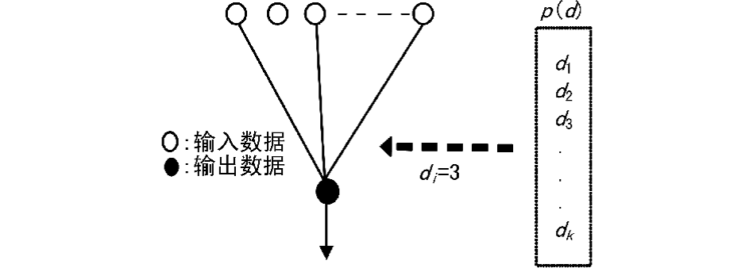
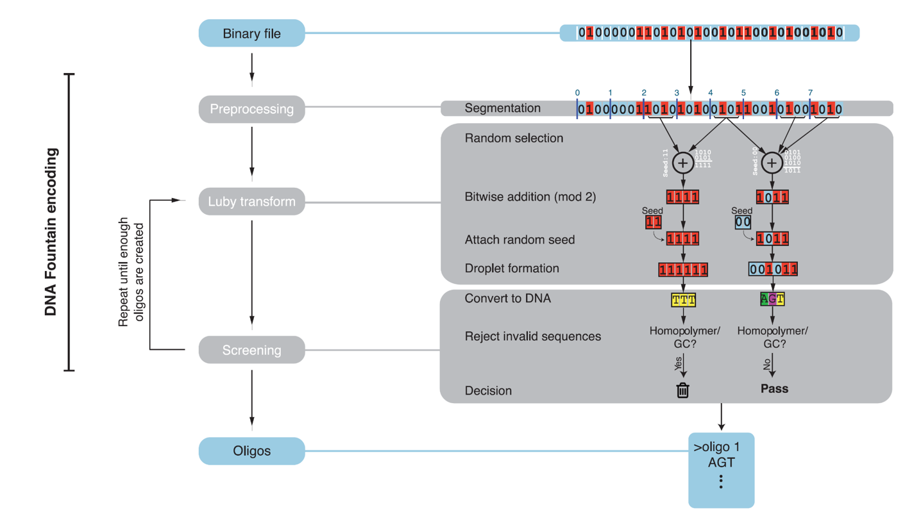
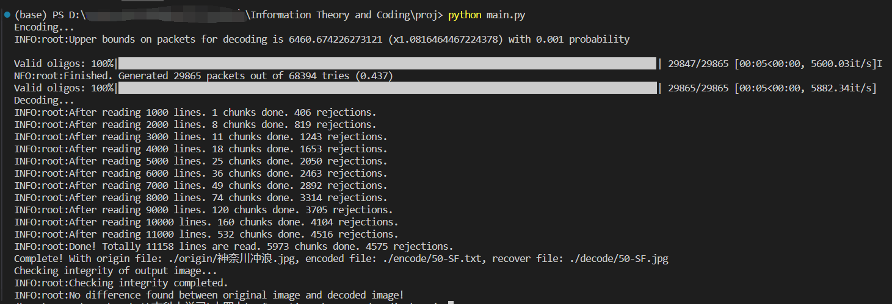

# EE411 Information Theory and Coding - Final Project

### Member
| SID      | Name              | Contribution |
| -------- | ----------------- | ------------ |
| 12011327 | Liu Leqi (刘乐奇) | All works    |

## Project Description

本项目采用“喷泉码”（Fountain Code，也称为无码率抹除码）进行编码和解码。“喷泉码”是一类抹除码，抹除码的实现思路就是将需要编码的文件按照一定方式生成很多的碎片集合，打散分布在资源池中，只要存留的碎片数量足够，就可以合并成原本的文件。

用简单的类比来形象地解释“喷泉码”：现在有一个信号发送源将需要发送的文件进行特定形式地切割与转换，形成一小片信息，类比成“水滴”（droplet），现在信号发送源将“水滴”不断地传给信号接收端，类比为“水杯”（glass），当“水杯”里获取到的“水滴” 足够多时，也就是信号接收 端能够准确对信息进行完全解码时，整个过程便完成了。 具体到这个项目而言，txt文件的每一行构成一个发送方与接收方之间传递的“水滴”，接收方（glass）需要先判断接收到的“水滴”是否有错误（Reed-Solomon Code），再判断“水滴”是否重复，如果没有问题，才将“水滴”装进“水杯”，当接收到的信息足以将“神奈川冲浪里”的图片恢复出来时，便不再装“水滴”。

## Luby transform Code

### Description

LT 码是一种具有线性编译码复杂度的喷泉码编码方式，LT 码在继承了随机线性喷泉码的优点的同时，大大降低了编码和解码的复杂度。

### Encode Algorithm

* 将待传送的讯息分割成等长度的n个packet，透过随机数产生器依据特定的概率分布产生一个整数degreed，且1<=d<=n，代表着一组讯息需要包含的封包数量。
* 接着在n组封包中，以离散型均匀分布的方式，选取d组封包出来。
* 然后将d组封包之间做异或运算，因此要传送的其中一个封包便是：M1⊕M2⊕…⊕Md，其中M1,M2,…Md是总共n组封包中被挑选出来的d组。
* 该传送的封包前面还须附加一些额外讯息，包括整份讯息有多少个封包（n个）、是哪d个封包被做了XOR运算。
* 最后，一些形式的侦错码将被附加在封包的最后（可能是某种循环冗余校），该封包才会被进行传输。

以上这些步骤将不断重复进行，直到接收端判断该讯息已被完整接收且成功地解码出来。



## Reed-solomon Code

### Description

RS码是一种纠错性能很强的线性纠错码，能够纠正随机错误和突发错误，能够同时纠正多个码元错误。

### Algorithm
选择一个合适的生成多项式g(x)，并且使得对每个信息字段计算得到码字多项式都是g(x)的倍式。如果接收到的码字多项式除以生成多项式的余式不是0，则可知道接收的码字中存在错误，经过进一步计算可以实现纠错。

纠错步骤：计算校正子 -> 计算错误位置 -> 计算错误值

## Project Structure

本项目的文件结构如下

```
proj
├─configs # 配置文件
│  └─...
├─decode # 编码文件
│  └─...
├─encode # 解码文件
│  └─...
├─origin # 源文件
│  └─...
├─reference # 参考文献
│  └─...
├─report # 报告
│  ├─pic # 报告图片
│  │  └─...
│  └─...
├─utils # 帮助代码
│  └─...
├─encode.py # 编码
├─decode.py # 解码
└─main.py # 程序入口
```

可通过如下命令在命令行启动

```shell
python main.py
```

## Coding

### Encode

#### Flow

* Preprocessing: 将输入的0、1串分段，随机选取随机的本段。

* Luby transform: 将信息保存于seed中，并每一个片段进行异或计算。
重复以上步骤，直至每个分段都能被执行此操作。

* Screening: 前端接入seed，后端接入RS码。将00, 01, 10, 11 翻译成A, C, G, T



#### Code

* 实例化 Encoder，并直接调用 encode() 方法

```python
print("Encoding...")
Encoder(
    input_file=origin_file,
    output_file=encode_file,
    chunk_size=chunk_size,
    rs=2,
    max_homopolymer=3,
    gc=0.05,
    delta=0.001,
    c_dist=0.025,
    final=chunk_num * 5,
).encode()
```

* 在 Encoder 类中实例化 DNAFountain

```python
self.dna_fountain = DNAFountain(
    input_file=input_file,
    chunk_size=chunk_size,
    rs=rs,
    max_homopolymer=max_homopolymer,
    gc=gc,
    delta=delta,
    c_dist=c_dist,
    alpha=alpha,
    final=final,
)
```

* 在 DNAFountain 类中有如下功能：
  * 产生用于分割的随机数
  ```python
  # starting an lfsr with a certain state and a polynomial for 32bits.
  self.lfsr = LFSR.lfsr_s_p()
  # calculate the length of lsfr in bits
  self.lfsr_l = len("{:b}".format(LFSR.lfsr32p())) - 1
  self.seed = next(self.lfsr)
  ```
  * 纠错编码
  ```python
  self.rs = rs  # the number of symbols (bytes) to add
  self.rs_obj = RSCodec(self.rs)  # initalizing an reed solomon object
  ```
  * 将 0，1 比特串转化为 ACGT 碱基信息
  ```python
  self.gc = gc
  self.max_homopolymer = max_homopolymer
  self.tries: int = 0  # number of times we tried to create a droplet
  self.good: int = 0  # droplets that were screened successfully
  # number of nucleotides in an oligo
  self.oligo_l = (self.chunk_size * 8 + self.lfsr_l + self.rs * 8) / 4
  ```

### Decode

#### Flow

* 通过add_dna方法将一条DNA序列加⼊容器，并对其进行解码。长度为100的DNA序列将会被转换成⻓度为25范围在0到255的int数组，这个int数 组中后5位是RS校验位，前4位是种子位（Seed），中间16位是数据位（payload）。 
通过RS Code对int数组进行更正，如果错误个数小于校验位的一半，则进行更正并保留，如果错误个数大于校验位的一半，则舍弃。
* 对更正后的数据与更正前的数据的差异位数进行计算，如果大于我们设置的最大汉明码，则错误率太高需要舍弃，否则保留。 
* 通过 seed = sum(int(x) 256 i for i, x in enumerate(seedarray[::-1]))这个公式从4位种子位计算种子，来检查本DNA序列是否已经进⼊容器。如果容器不包含本DNA序列，则构造水滴实例包装DNA相关信息，并将水滴存⼊容器。 
* 当判断容器里面已经有足够多的水滴来对图片进行解码时，停止加⼊新的水滴，并输出图片。

#### Code

* 实例化 Decoder，并直接调用 decode() 方法
```python
print("Decoding...")
Decoder(
    input_file=encode_file,
    output_file=decode_file,
    chunk_num=chunk_num,
    header_size=4,
    rs=2,
    delta=0.001,
    c_dist=0.025,
    gc=0.05,
    max_homopolymer=3,
    max_hamming=0,
).decode()
```

* 在 Decoder 类中实例化 glass
```python
self.glass = Glass(
    self.chunk_num,
    header_size=self.header_size,
    rs=self.rs,
    c_dist=self.c_dist,
    delta=self.delta,
    gc=self.gc,
    max_homopolymer=max_homopolymer,
    max_hamming=max_hamming,
)
```

* glass 对象每次通过 add_dna() 方法对读入的一条条 DNA 序列进行解码

```python
with open(self.input_file, "r") as file:
    while True:
        dna = file.readline().rstrip("\n")
        if len(dna) == 0:
            logging.info("Finished reading input file!")
            break

        line += 1
        seed, data = self.glass.add_dna(dna)
```

* 直至每条 DNA 都正确装入 glass 中，解码完成
```python
if self.glass.is_done():
    logging.info(
        "Done! Totally {} lines are read. {} chunks done. {} rejections.".format(
            line, self.glass.chunks_done(), errors
        )
    )
    break
```

* add_dna() 方法是如何对读入的一条条 DNA 序列进行解码的？
  * ⻓度为100的DNA序列将会被转换成⻓度为25范围在0到255的int数组，这个int数组中后5位是RS校验位，前4位是种⼦位（Seed），中间16位是数据位（payload）
  ```python
  def _dna_to_int_arr(self, dna_str: str) -> List[int]:
      num_str = dna_str.replace("A", "0").replace("C", "1").replace("G", "2").replace("T", "3")
      s = "".join("{0:02b}".format(int(num_str[i])) for i in range(len(num_str)))
      data = [int(s[t : t + 8], 2) for t in range(0, len(s), 8)]
      return data

  def add_dna(self, dna_str: str) -> Tuple[int, List[int]]:
      data = self._dna_to_int_arr(dna_str)
      ...
  ```
  * 通过 RSCode 对前一步骤所得的数组进行验证、纠错
  ```python
  try:
      # evaluate the error correcting code
      data_corrected = list(self.RSCodec.decode(data)[0])
  except:
      # could not correct the code
      return -1, None
  # encode the data again to evaluate the correctness of the decoding
  # list() is to convert byte array to int
  data_again = list(self.RSCodec.encode(data_corrected))
  # measuring hamming distance between raw input and expected raw input
  if np.count_nonzero(data != list(data_again)) > self.max_hamming:
      # too many errors to correct in decoding
      return -1, None
  ```
  * 无误后将此份解码结果送出，结果包含 seed 和 data。seed 起标志作用，用于区分不同的数据块

## Result




## Reference

[1] [深入理解喷泉码------喷泉码的编译码算法详解及实现](https://blog.csdn.net/zk3326312/article/details/79305932)

[2] Erlich, Yaniv, Zielinski, et al. DNA Fountain enables a robust and efficient storage architecture.[J]. Science, 2017.

[3] Erlich Y , Zielinski D . Capacity-approaching DNA storage. 2016.

[4] M. Luby, “LT-codes,” in Proc. 43rd Annu. IEEE Symp. Foundations of Computer Science (FOCS), Vancouver, BC, Canada, Nov. 2002, pp. 271–280.

[5] Mceliece R J . The theory of information and coding:a mathematical framework for communication[M]. Addison-Wesley Pub. Co. Advanced Book Program, 1977.

[6] Zhang, Jiajie, Kobert, et al. PEAR: a fast and accurate Illumina Paired-End reAd mergeR.[J]. Bioinformatics, 2014.

